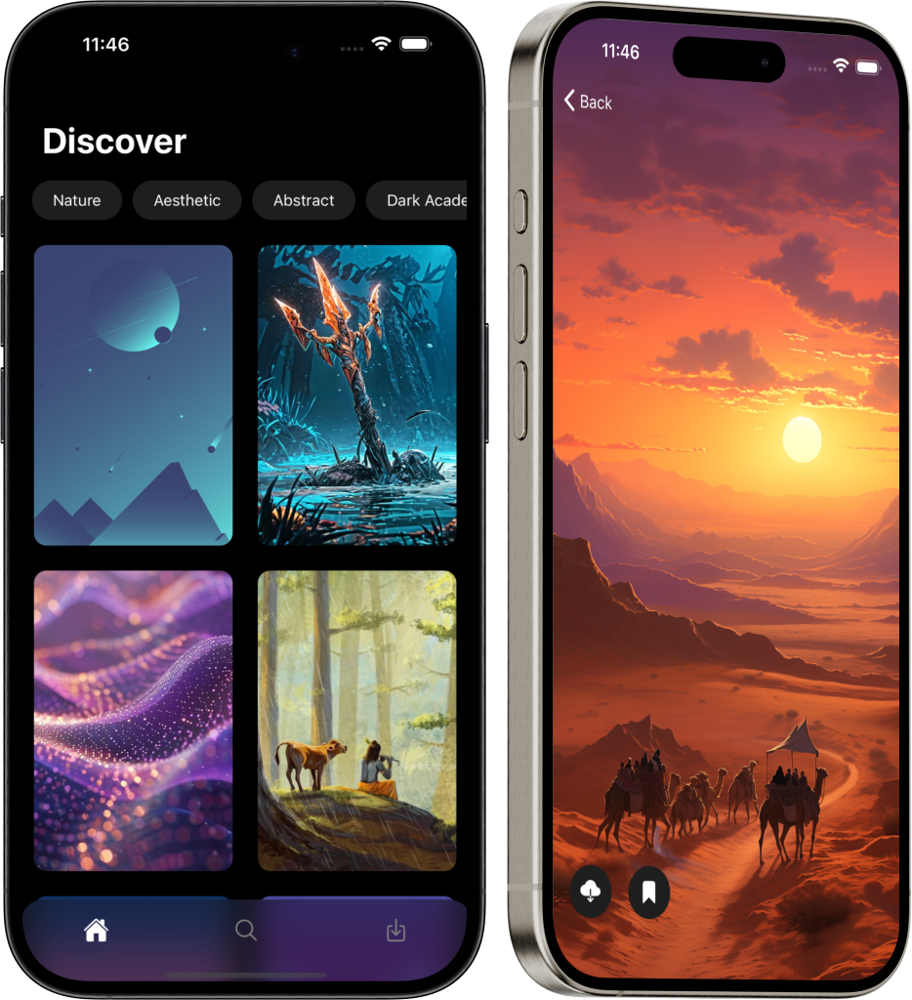

<p align="center">

</p>

<h1 align="center">React Native Wallpaper App</h1>

<p align="center">
A sleek and modern wallpaper app built with React Native. Simple, user-friendly, and responsive design with smooth animations.
</p>

<p align="center">
  <a href="https://github.com/rit3zh/react-native-wallpaper-app">
    
  </a>
  <a href="https://github.com/rit3zh/react-native-wallpaper-app" target="_blank">
    
  </a>
  <a href="https://github.com/rit3zh/react-native-wallpaper-app" target="_blank">
    
  </a>
  <!-- <a href="https://github.com/your-username/wallpaper-app">
    
  </a>
  <a href="https://github.com/your-username/wallpaper-app">
    
  </a> -->
</p>

## 📜 Description

Welcome to the React Native Wallpaper App! This app provides a clean and modern interface for browsing and setting wallpapers on your device. It features:

- 🌟 **Sleek and Modern Design:** A user-friendly and visually appealing interface.
- 📱 **Responsive Design:** Adapts seamlessly to different screen sizes.
- 🎨 **Smooth Animations:** Enjoy a delightful user experience with smooth transitions and interactions.

## 🚀 Features

- Browse a wide range of wallpapers.
- Set wallpapers with a single tap.
- Enjoy smooth scrolling and animations.

## 🛠️ Installation

1. **Clone the repository:**

   ```sh
   git clone https://github.com/rit3zh/react-native-wallpaper-app.git
   ```

2. **Navigate to the project directory:**

   ```sh
   cd react-native-wallpaper-app
   ```

3. **Install dependencies:**

   ```sh
   npm install
   ```

4. **Run the app:**

   ```sh
   npm start
   ```

## 👥 Contributing

Contributions are welcome! Feel free to open an issue or submit a pull request.
